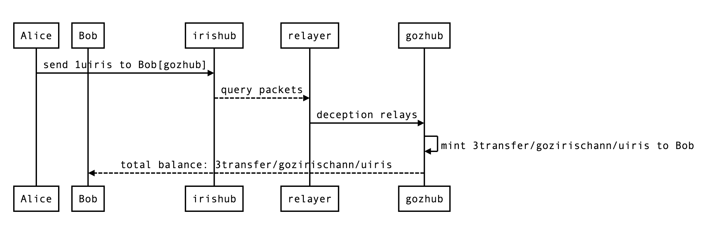
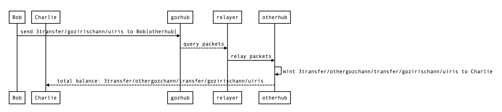
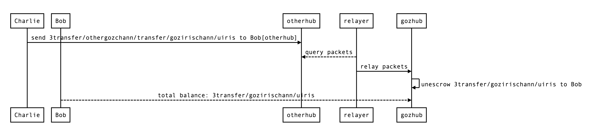
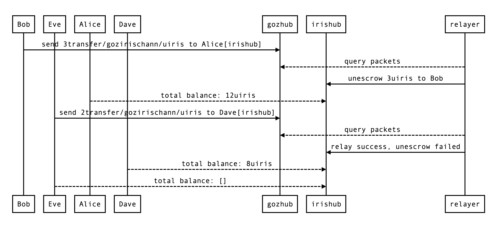

# ICS-20 Abnormal Scenes

This article demonstrates the abnormal situation of ICS-20 in the IBC protocol through a series of consecutive scenes. This is illustrated by the interaction between Alice, Bob, Charlie, Dave, and Eve on gozhub, irishub, and otherhub.

In those scenes, all hubs use the official gaia version of goz-phase-3, without modifying the code.

## Initial state

**path**

`gozhub` - `irishub`

- gozhub
  - port: `transfer`
  - channel: `irisgozchann`

- irishub
  - port: `transfer`
  - channel: `gozirischann`

`gozhub` - `otherhub`

- gozhub
  - port: `transfer`
  - channel: `othergozchann`

- irishub
  - port: `transfer`
  - channel: `gozotherchann`

**balance**:

- Alice
  - irishub: `10uiris`
  - gozhub: `[]`
  - otherhub: `[]`
- Bob
  - irishub: `[]`
  - gozhub: `[]`
  - otherhub: `[]`
- Charlie
  - irishub: `[]`
  - gozhub: `[]`
  - otherhub: `[]`
- Dave
  - irishub: `10uiris`
  - gozhub: `[]`
  - otherhub: `[]`
- Eve
  - irishub: `[]`
  - gozhub: `[]`
  - otherhub: `[]`

## Scenes

### Scene 1

Alice has `10uiris` on irishub, Bob wants to buy `3uiris`. IBC connection has been established between irishub and gozhub, to facilitate asset management, Bob decides that all assets are stored in the account on gozhub. The transaction method is cross-chain transfer from Alice's account on irishub to Bob's account on gozhub.

Alice only transferred `1uiris` via cross-chain transaction, but successfully transferred `3transfer/gozirischann/uiris` to Bob’s account on gozhub through the deceptive relay method. But Bob didn't know that and he thought his token was correct.

Balance status at the end of the scene:

- Alice
  - irishub: `9uiris`
  - gozhub: `[]`
  - otherhub: `[]`
- Bob
  - irishub: `[]`
  - gozhub: `3transfer/gozirischann/uiris`
  - otherhub: `[]`
- Charlie
  - irishub: `[]`
  - gozhub: `[]`
  - otherhub: `[]`
- Dave
  - irishub: `10uiris`
  - gozhub: `[]`
  - otherhub: `[]`
- Eve
  - irishub: `[]`
  - gozhub: `[]`
  - otherhub: `[]`

### Scene 2

After a period of time, the market changed and Bob and Charlie reached a deal to transfer `3transfer/gozirischann/uiris` in their hands. Charlie's assets are mainly in otherhub, and otherhub has also successfully established a connection with gozhub. The transaction method is cross-chain transfer from Bob's account on gozhub to Charlie's account on otherhub.

After the transaction, Charlie successfully received `3transfer/othergozchann/transfer/gozirischann/uiris` on otherhub. Charlie is unaware of the transaction between Alice and Bob, and believes that the received token is equivalent to `3uiris` on irishub.

Balance status at the end of the scene:

- Alice
  - irishub: `9uiris`
  - gozhub: `[]`
  - otherhub: `[]`
- Bob
  - irishub: `[]`
  - gozhub: `[]`
  - otherhub: `[]`
- Charlie
  - irishub: `[]`
  - gozhub: `[]`
  - otherhub: `3transfer/othergozchann/transfer/gozirischann/uiris`
- Dave
  - irishub: `10uiris`
  - gozhub: `[]`
  - otherhub: `[]`
- Eve
  - irishub: `[]`
  - gozhub: `[]`
  - otherhub: `[]`

### Scene 3

After a while, Bob decides to buy back the token transferred to Charlie. Charlie transferred `3transfer/othergozchann/transfer/gozirischann/uiris` on otherhub to Bob's account on gozhub.

The transaction was successfully completed, and the forged token in scene 1 can be circulated normally in the IBC network.

Balance status at the end of the scene:

- Alice
  - irishub: `9uiris`
  - gozhub: `[]`
  - otherhub: `[]`
- Bob
  - irishub: `[]`
  - gozhub: `3transfer/gozirischann/uiris`
  - otherhub: `[]`
- Charlie
  - irishub: `[]`
  - gozhub: `[]`
  - otherhub: `[]`
- Dave
  - irishub: `10uiris`
  - gozhub: `[]`
  - otherhub: `[]`
- Eve
  - irishub: `[]`
  - gozhub: `[]`
  - otherhub: `[]`

### Scene 4

Dave has `10uiris` on irishub. One day his friend Eve wants to borrow `2uiris` on gozhub. Dave transferred 2uiris on irishub to Eve's account on gozhub via cross-chain transaction. After the transaction is completed, Eve received `2transfer/gozirischann/uiris` on gozhub.

Balance status at the end of the scene:

- Alice
  - irishub: `9uiris`
  - gozhub: `[]`
  - otherhub: `[]`
- Bob
  - irishub: `[]`
  - gozhub: `3transfer/gozirischann/uiris`
  - otherhub: `[]`
- Charlie
  - irishub: `[]`
  - gozhub: `[]`
  - otherhub: `[]`
- Dave
  - irishub: `8uiris`
  - gozhub: `[]`
  - otherhub: `[]`
- Eve
  - irishub: `[]`
  - gozhub: `2transfer/gozirischann/uiris`
  - otherhub: `[]`

### Scene 5

After a period of time, the market changed, Alice bought back all Bob's uiris. Then Bob transferred `3transfer/gozirischann/uiris` on gozhub to Alice's account on irishub via cross-chain transaction. After the transaction is completed, Alice owns `12uiris` on irishub.

Soon after, Eve decided to pay back Dave’s uiris, then Eve transferred `2transfer/gozirischann/uiris` on gozhub to Dave’s account on irishub via cross-chain transsaction. Eve successfully sent the transaction on gozhub, the account balance decreased by `2transfer/gozirischann/uiris`. But Dave could not receive the token. Though the packet was successful relayed, the balance of escrow account was insufficient during the execution of the packet.

Balance status at the end of the scene:

- Alice
  - irishub: `12uiris`
  - gozhub: `[]`
  - otherhub: `[]`
- Bob
  - irishub: `[]`
  - gozhub: `[]`
  - otherhub: `[]`
- Charlie
  - irishub: `[]`
  - gozhub: `[]`
  - otherhub: `[]`
- Dave
  - irishub: `8uiris`
  - gozhub: `[]`
  - otherhub: `[]`
- Eve
  - irishub: `[]`
  - gozhub: `[]`
  - otherhub: `[]`

## Conclusion

The final result is that Dave can't get his assets back, and Alice has invaded `2uiris` which should belong to Dave.

In scene 1, the fake tokens issued by Alice on gozhub are exactly the same as normal cross-chain tokens and can be circulated normally in the entire IBC network.

When the cross-chain tokens were sent back to the original chain, the number of native tokens that can be unescrowed is less than the total number of cross-chain tokens issued by the counterparty chain. The earlier exchange will be successful, and the last exchange will be failed.
